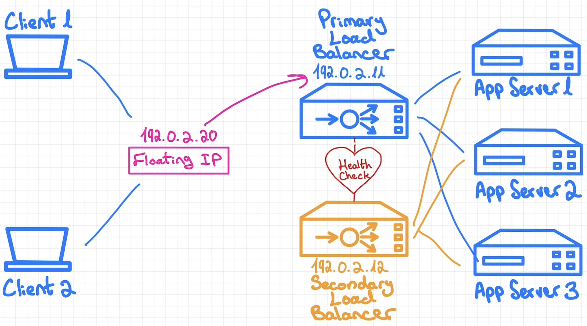

### System Design

# AVAILABILITY

Availability refers to the % of time a system is up & performing its intended function

Because we deal with very high percentages when it comes to availability, its common to measure it in terms of 9s

* If a system is available 99% of the time, we say it has 2 Nines of availability

| Availability | Downtime per year| Nines |
| ---- | ---- | ---- |
| 90% | 36.5 days | 1 Nine |
| 99% | 3.65 days | 2 Nines | 
| 99.9 % | 8.7 hours | 3 Nines |
| 99.99 %  | 52 mins | 4 Nines | 
| 99.999 % | < 6mins | 5 Nines (**GOLDEN STANDARD**) |

5 Nines is a pretty challenging bar to reach. But some systems may require it and hence may be worth the investment

---
## Factors Affecting Availability

Issues which can create problems with availability

* Hardware Issues
    * Power outage
        * If there is a region wise power outage OR natural disaster, and we keep all our servers in that area
    * Server Crash
    * Natural Disaster
    * Resources can run out (Server run out of space & hence fail to process new requests)

* Software Bugs
    * Memory Leaks
    * Bug in a microservice itself

---

Design the systems with high availability it not about fixing those mistakes or avoiding these failures. 

Its about accepting the fact that failures are inevitable. Our aim is to keep systems at large operational

Number one way to do that is to eliminate **SINGLE POINT OF FAILURES**

## Problem 1

Example: If we use single server &rarr; if scale increases, this server will become **bottleneck** for SPOF. 
Even powerful machines have a limit of how many requests they can serve

### Solution 1

* <u>REDUNDANCY</u> : Duplicating parts of the system
    * In order to scale the system and eliminate SPOF, we can add more app servers
    * If one server goes down, other servers will cater to incoming requests & system will be available

        

    * We will need a LB to decide where to send the incoming request. I will do that based on some distribution strategy
    * If any server goes down, LB will become aware of that & will stop sending the requests to the dead server untill it recovers (It knows the state of all servers)

## Problem 2

After using LB, we find ourselves in a similar position: What happens if the LB goes down
* Now all client request will go nowhere

### Solution 2

Solution for this is again REDUNDANCY

We will go for a backup setup. We add a second LB which will remain passive (Not take any request)

It will come into action only when our primary LB stops functioning

* We can implement this functionality by sing a <u>**floating IP**</u> and a health check service 
* Floating IP is a kind of virtual IP that is mapped to one of these nodes and acts as the gateway to our service
* In a healthy state it will be mapped to our primary LB
* Two LB will monitor each other health by sending health check messages back and forth
* If the primary LB dies, health check will fail &rarr; This is how secondary LB will know that it needs to take over

* We can write a script to assign the floating ip to the secondary LB and once primary LB restores we can reassign the floating ip to primary

---

## Problem 3

If power outage / natural disaster occurs in the area where you keep all your servers

### Solution 3

* To distribute your servers across multiple regions. It is preferable to duplicate entire application stack

* That way our application can run independently at each location

* If one region server goes down, other region server can cater all the requests

* This will also reduce latency since clients requests from India can be addressed using server in India and client requests from USA can be addresses from the USA server

---
### Practicality

* All this seems fine on paper but in real life all these things come at a cost
    * Running multiple servers needs significant investment
* Adding more components not only costs more money but also makes the system complex
    * Which in turn increases the odds that somewhere something can break
* It can also come with some data inconsistency challenges

Hence we should be mindful that how these things will make sense in the REAL WORLD

We should only add those complexeties which we can justify

