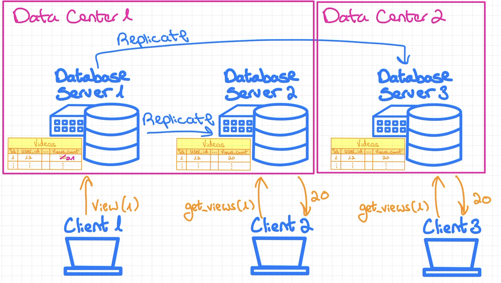

### System Design

# DATA CONSISTENCY

Achieving high consistency in a large scale system can be challenging

---

First of all, if we keep just a single DB server it will result into SINGLE POINT OF FAILURE

Hence, we need multiple DB Servers. This is where we start facing consistency issues

---

There are two type of consistency:

1. Strong Consistency 
    * Every read request returns most up-to-date value
    * Throws error if it can't
2. Eventual Consistency
    * Once data is updated, eventually read requests will return the most updated value

---

### Example: Views counter of Youtube videos

